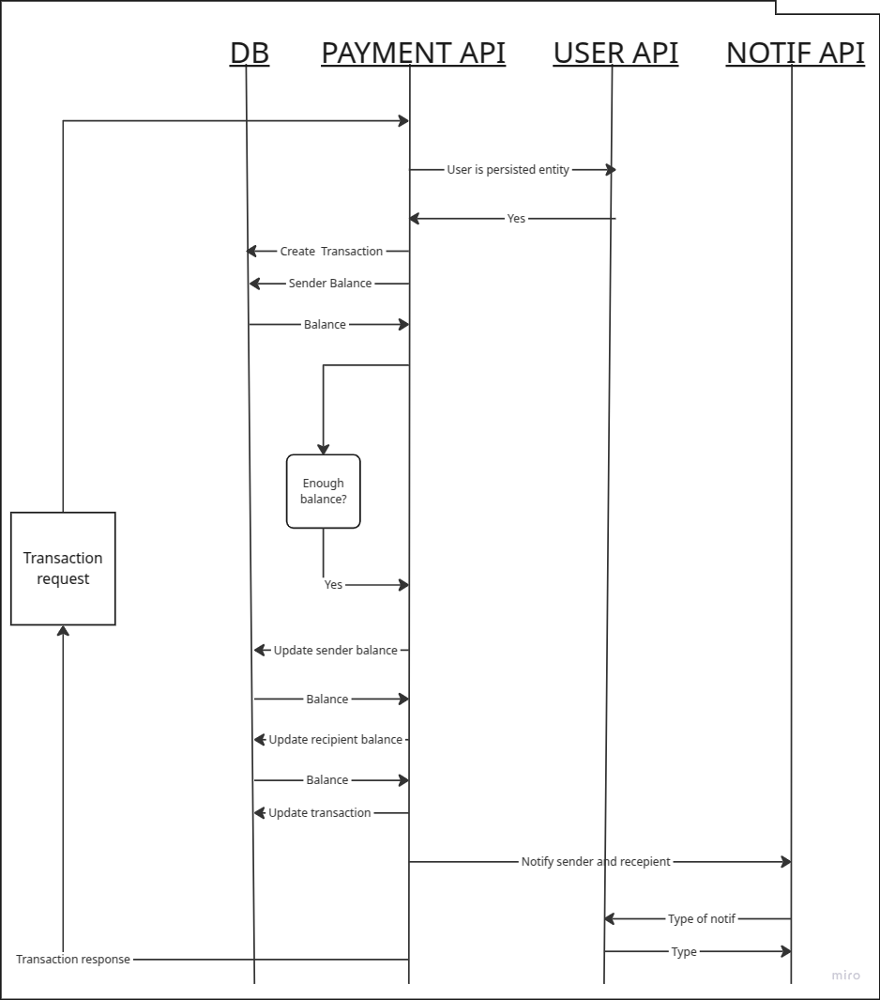

# Instant Payment API Review

## Project Overview
The Instant Payment API provides a comprehensive payment solution with a modular architecture. Built on Java and Maven, the system prioritizes scalability, security, and maintainability across its components.
My actual project is focusing on local development and deployment. On the production environment, I would use GCP Cloud Run Load Balancer, Nginx, and Cloud SQL and Terraform for infrastructure management.
The service ports are opened to the internet, of course just for local development purposes in production environment it should be hidden behind the load balancer and Nginx.
The user authentication is handled by a dummy JWT handled by the User API, which is not secure and should not be used in a production.
Unfortunately, I did not have time to implement test cases for this project, but if I would do it, I would use Junit and Mockito for unit testing and MVC or Karate and Cucumber for integration testing. 

## Architecture


The solution is implements only one use case:

<br>


### Payment API
- Handles all transaction processing and payment method management
- Implemented with Spring Boot and Maven
- Containerized with Docker for deployment flexibility
- Produces payment updates for the Notification API through Kafka

### Notification API
- Consumes payment updates from the Payment API
- Manages communication with users for payment confirmations and updates
- Built on Spring Boot and Maven
- Docker-ready for consistent deployment

### User API
- Controls user profile data and authentication flows
- Spring Boot and Maven implementation
- Dockerized for deployment consistency

### Shared Library
- Contains common utilities and dependencies
- Centralized Maven configuration for cross-module use

## Technical Implementation

### Containerization
All modules follow a consistent containerization approach:
- Individual Dockerfiles for each component
- Deployment documentation included
- Ready for orchestration with docker-compose

### Build System
- Maven-based dependency management throughout
- Hierarchical POM structure with parent-child relationships
- Centralized build automation

### Security Features
- Dummy JWT authentication system for secure API access

### Error Management
- Comprehensive exception handling via Spring's @ExceptionHandler
- Consistent error response format across all endpoints
- Standardized error logging
- Consistent error codes and descriptions which are available in the shared-lib error codes enum

## Documentation
- Swagger integration for interactive API documentation
- Self-documenting endpoints accessible through Swagger UI
- Clear build and deployment instructions

## Getting Started
1. Clone the repository
2. Navigate to the root directory and create .env file with the required environment variables. They are defined in the .env.example
```
KAFKA_KRAFT_CLUSTER_ID=8kM_zW1WSgC44YX8Fh71Ig

USER_DB_URL=jdbc:postgresql://user-db:5432/user_db
USER_DB_NAME=user_db
USER_DB_USERNAME=user_user
USER_DB_PASSWORD=user_password

PAYMENT_API_URL=http://payment-api:8080

PAYMENT_DB_URL=jdbc:postgresql://payment-db:5432/payment_db
PAYMENT_DB_NAME=payment_db
PAYMENT_DB_USERNAME=payment_user
PAYMENT_DB_PASSWORD=payment_password
USER_API_URL=http://user-api:8080

JWT_SECRET=Bh.KzaRBW{garwNNwAf$c32X2rh2twerfwf
JWT_EXPIRATION=3600000

KAFKA_TOPIC=notification
```
3. Execute `docker-compose up -d` to launch the containerized services
4. Access the API documentation at http://localhost:8080/swagger-ui/index.html
5. For testing with Insomnia, use the provided insomnia.json file which is available in docs folder
6. For running from Intellij Ideal, use the provided run configuration which is available in the root directory in the .run folder
